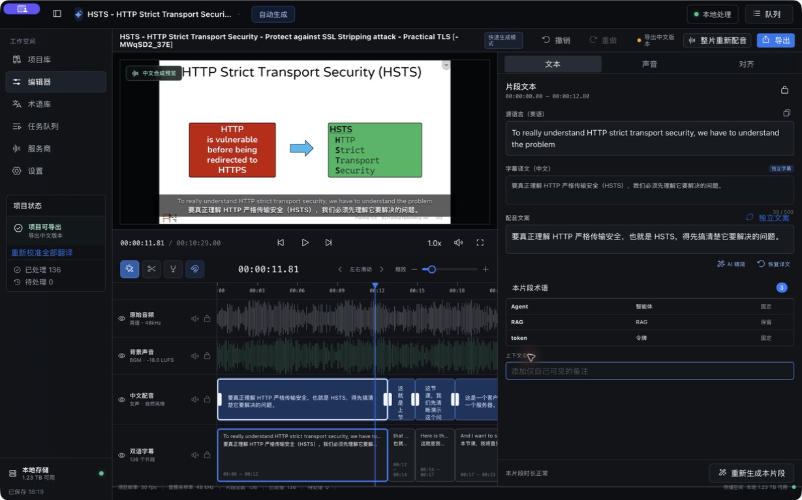
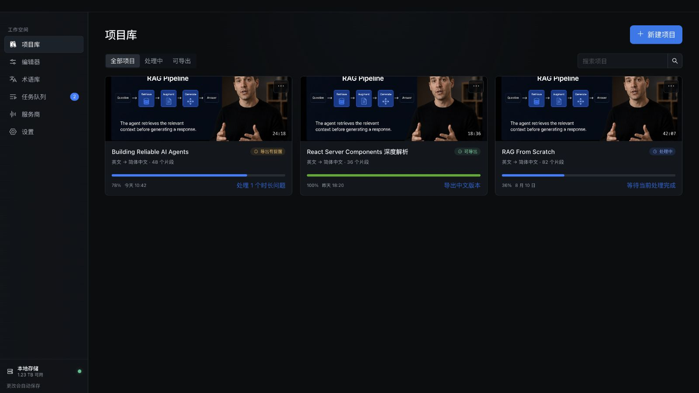
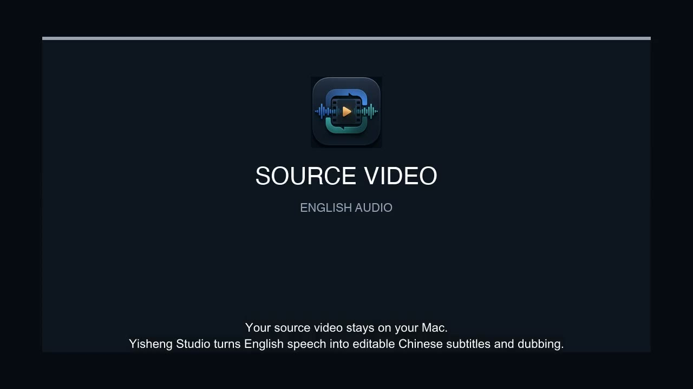
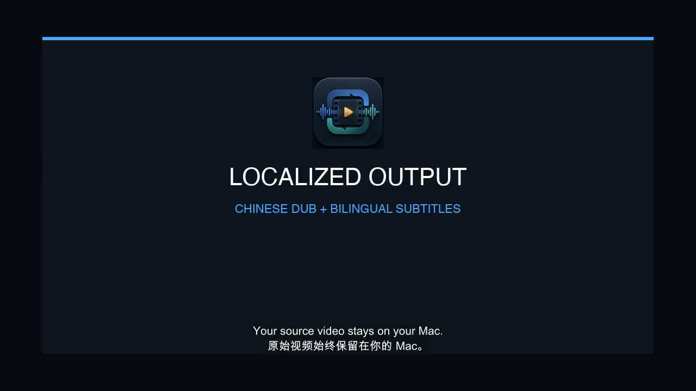
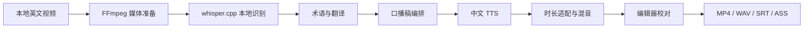

# 译声工坊

> 面向 macOS 的本地优先 AI 视频中文化工作台：把英文视频变成可校对、可局部重生成、可导出的中文配音版本。

译声工坊不是一个“上传视频后等待结果”的云端网站。它在用户自己的 Mac 上管理原视频、媒体处理、英文识别、时间轴、字幕、配音和导出，只把完成任务所必需的文本发送给用户主动配置的翻译或在线语音服务。



## 它能做什么

导入一段用户拥有合法使用权的英文技术视频后，译声工坊可以完成：

1. 使用 FFmpeg 检查视频、生成本地代理、抽取识别音频和封面；
2. 使用 whisper.cpp 在本地识别英文并生成带时间戳的片段；
3. 调用用户配置的 OpenAI 兼容翻译服务，生成中文字幕和更适合口播的中文文案；
4. 使用 macOS 系统语音、阿里百炼或讯飞合成中文配音；
5. 在四轨时间轴中校对原文、译文、口播稿、配音和时长风险；
6. 只重做受修改影响的片段，并从检查点继续长任务；
7. 导出中文配音 MP4、中文/英文 SRT、中英双语 ASS 和 48 kHz 中文 WAV。



## 转译前 / 转译后

下面的轻量样片使用仓库自有文案和 macOS 系统语音生成，用来直观说明输入与输出形态。它不是特定云端 TTS 服务商的音质评测。

| 英文原片 | 中文配音成片 |
| --- | --- |
| [](docs/readme/demo-before.mp4) | [](docs/readme/demo-after.mp4) |
| [播放英文原片（MP4）](docs/readme/demo-before.mp4) | [播放中文配音版（MP4）](docs/readme/demo-after.mp4) |

演示素材可通过 `./scripts/generate-readme-demo.sh` 在 macOS 上重新生成。真实成片质量取决于源视频、翻译结果、所选声音、原声处理模式以及人工校对。

## 处理链路



项目使用版本化工作流 Runner 管理长任务。暂停、失败或应用重启后，可以从已完成的节点继续；修改单个片段时，不需要重新执行无关的上游步骤。

## 核心能力

- **本地优先**：原视频只保留本地路径引用；代理、识别结果、中间音频、数据库和导出结果均在本机处理。
- **专业编辑器**：暗色三栏工作区、真实视频预览、片段检查器、四轨时间轴、风险提示和批量操作。
- **字幕与口播分离**：字幕可追求忠实，配音文案可针对中文表达和时长单独优化。
- **可控时间轴**：片段音频不会互相侵入；超出自然语速适配范围时会阻止或提醒导出。
- **局部重生成**：支持编辑、拆分、合并、边界调整、撤销/重做、单片段重配和整片重配。
- **多 Provider**：翻译支持 DeepSeek、阿里百炼及自定义 OpenAI 兼容接口；配音支持 macOS 系统语音、阿里百炼 Qwen/CosyVoice 和讯飞超拟人语音。
- **可恢复任务**：SQLite 持久化任务、片段、Artifact 和检查点，支持暂停、继续、取消、失败重试和崩溃恢复。
- **发布前检查**：导出前检查缺失配音、过期片段、时长冲突和混音问题。

## 隐私与网络边界

| 数据 | 默认位置 | 何时会离开本机 |
| --- | --- | --- |
| 原视频、原始音轨、代理视频 | 本机 | 不上传 |
| whisper.cpp 识别音频 | 本机 | 不上传 |
| 字幕文本、必要上下文和术语 | 本机数据库 | 仅在调用用户选择的在线翻译服务时发送 |
| 中文口播稿和声音参数 | 本机数据库 | 仅在调用用户选择的在线 TTS 时发送 |
| API Key / Secret | macOS Keychain | 仅发往对应服务商；不会写入 SQLite、普通配置或诊断包 |

项目不提供视频平台下载、开发者中转服务、账号云同步或遥测。请只导入自己拥有或已经获得授权的视频，并自行确认翻译、配音和公开发布衍生内容的权利。

更完整的边界说明见 [隐私、数据发送与版权边界](docs/product/PRIVACY_AND_COPYRIGHT.md)。

## 当前状态与限制

这是一个可运行的工程项目，主链路和本地验证已建立，但还不是可直接面向普通用户分发的正式产品：

- 当前只支持 macOS 13+，主流程为英文转简体中文；
- 浏览器模式只展示固定数据；文件导入、Keychain、FFmpeg、识别、配音和导出必须在 Tauri 桌面应用中使用；
- FFmpeg、whisper.cpp `v1.9.2` 和 `small.en` 模型需要开发者预先准备，运行时安装器仍待完善；
- 人声分离代码已经接入，但正式运行时打包与更多样片验收仍在进行；
- 仓库构建默认没有 Apple Developer ID 签名和 notarization，不应直接作为公开发行包；
- 在线翻译与在线 TTS 会产生对应服务商费用，应用不会代付或代理请求。

## 本地开发

### 1. 准备环境

- macOS 13 或更高版本；
- 当前维护版 Node.js 和 pnpm；
- Rust stable、`rustfmt` 与 `clippy`（仓库的 `rust-toolchain.toml` 会声明所需组件）；
- FFmpeg 与 ffprobe。开发机可使用 `brew install ffmpeg`，正式分发需要自行准备满足许可证要求的 Sidecar；
- 完整识别链路还需要 whisper.cpp `v1.9.2` 的 `whisper-cli` 和 `ggml-small.en.bin`。

应用在开发环境中读取以下运行时位置：

```text
~/Library/Application Support/com.yishengstudio.desktop/
├── models/ggml-small.en.bin
└── runtimes/whisper-cpp-v1.9.2/whisper-cli
```

whisper.cpp 与模型请从其[官方仓库](https://github.com/ggml-org/whisper.cpp)获取，并遵守各自许可证。模型和第三方测试视频不提交到本仓库。

### 2. 安装依赖并启动

```bash
pnpm install
```

只查看浏览器演示界面：

```bash
pnpm dev
```

运行具备本地媒体能力的 Tauri 桌面开发版：

```bash
pnpm dev:desktop
```

生成一个可从 Finder 独立打开的调试版 `.app`：

```bash
pnpm dev:app
```

API Key 不使用 `.env` 配置。请在应用左侧的“服务商”页面添加服务商并测试连接，敏感凭据会写入 macOS Keychain。

## 本地数据与导出

应用数据默认位于：

```text
~/Library/Application Support/com.yishengstudio.desktop/
```

其中包含 SQLite 数据库、项目代理、识别音频、配音缓存、预览和运行时组件。原视频不会复制到项目目录，删除应用数据前请先确认是否仍需保留工程状态。

一次完整导出会生成：

```text
中文配音视频.mp4
中文配音.wav
中文字幕.srt
英文字幕.srt
中英双语.ass
配音同步字幕.srt
配音同步双语.ass
```

选择安全背景声模式时还会导出 `背景与音效.wav`。

## 项目结构

```text
src/                    React、TypeScript、页面与编辑器
src-tauri/src/          Rust 领域逻辑、工作流、媒体、Provider 与导出
src-tauri/icons/        macOS 构建所需图标与可再生成的主图标
docs/architecture/      技术方案与架构决策
docs/product/           PRD、隐私版权与体验规划
docs/engineering/       工程学习日志与重构记录
docs/design/            设计规范、视觉基准与精简后的 QA 说明
docs/readme/            README 截图和可重新生成的演示素材
scripts/                架构检查、并行验证与演示素材脚本
tests/                  站点/Worker 侧测试
```

## 验证

日常修改使用快速验证：

```bash
pnpm verify:fast
```

提交或交付前运行完整验证：

```bash
pnpm verify:full
```

只有在确实需要刷新独立 macOS App 时才运行：

```bash
pnpm verify:release
```

`verify:release` 生成的是本机调试用途的 ad-hoc 签名包；公开分发仍需要 Developer ID 签名和 notarization。Sites 不属于默认流程，只有 Sites 相关变更才运行 `pnpm verify:sites`。

## 架构与设计文档

- [系统技术方案](docs/architecture/TECHNICAL_SOLUTION.md)
- [本地优先 Tauri ADR](docs/architecture/ADR-001-local-first-tauri.md)
- [版本化工作流 ADR](docs/architecture/ADR-002-versioned-workflow-runner.md)
- [产品需求文档](docs/product/PRD.md)
- [设计规范](docs/design/DESIGN_SPEC.md)
- [视觉验收说明](design-qa.md)
- [工程学习日志](docs/engineering/LEARNING_LOG.md)

## 参与贡献

欢迎通过 Issue 或 Pull Request 参与。提交代码前请：

1. 不提交 API Key、Cookie、用户视频、模型文件、应用数据目录或带真实凭据的截图；
2. 保持原视频本地优先，并在新增网络请求时明确说明发送的数据；
3. UI 延续专业暗色视频编辑器、紧凑密度、四轨时间轴和既有语义色；
4. 使用 Phosphor Icons，不用 emoji、文本字符或临时 SVG 替代产品图标；
5. 运行 `pnpm verify:full`，涉及视觉变更时同步更新 `design-qa.md`。

## 开源许可

仓库目前尚未包含 `LICENSE` 文件，因此还不能视为已经完成开源授权。公开发布前，维护者需要明确选择许可证（例如 MIT 或 Apache-2.0）并检查 FFmpeg Sidecar、whisper.cpp、模型、人声分离组件、字体和演示素材各自的分发条款。未获授权的第三方视频不应提交到仓库或 Release。
