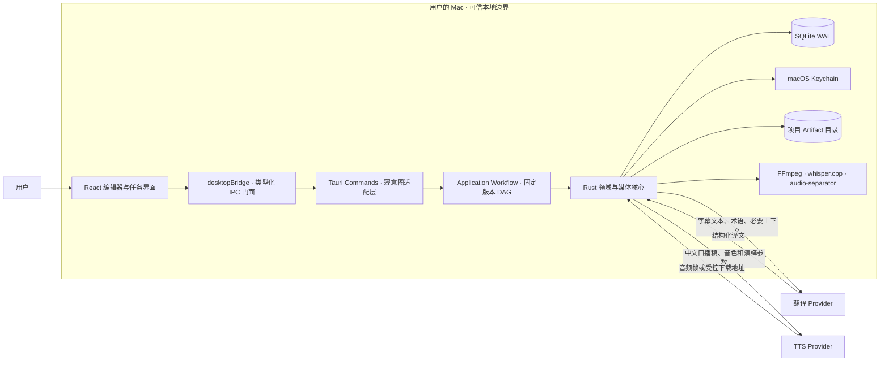
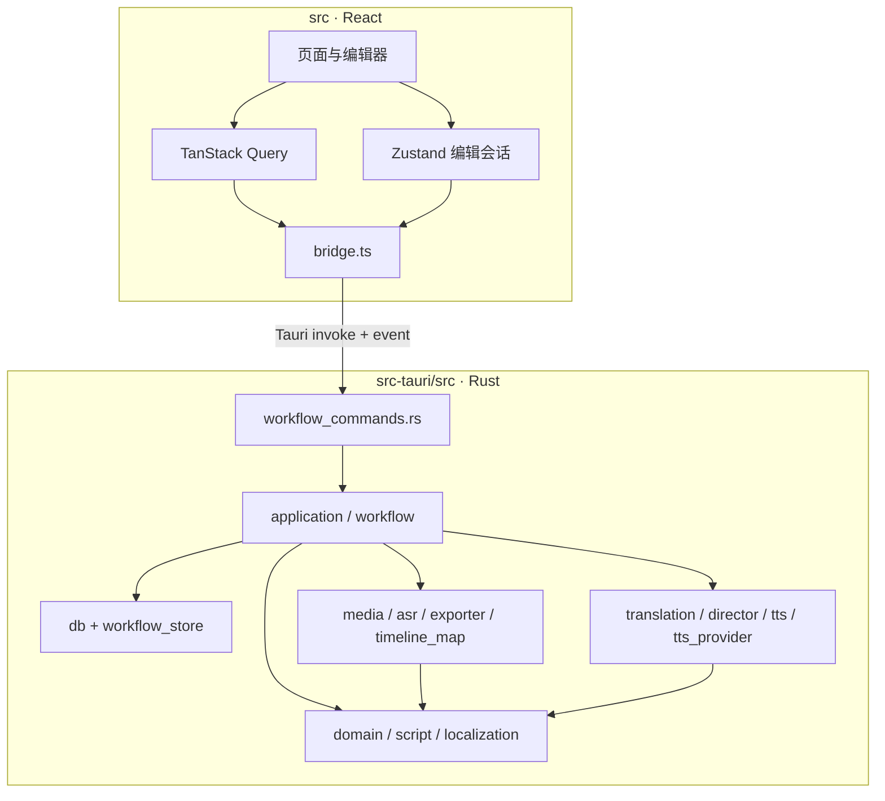
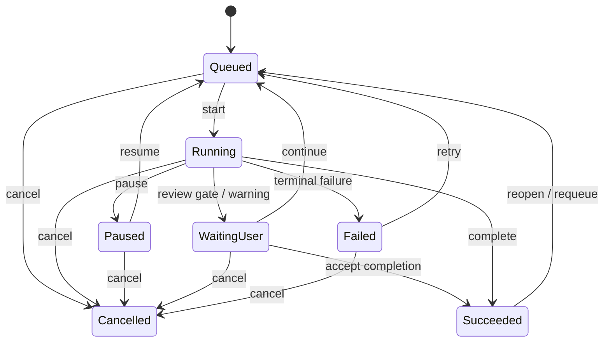
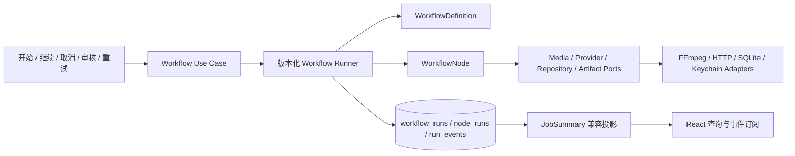
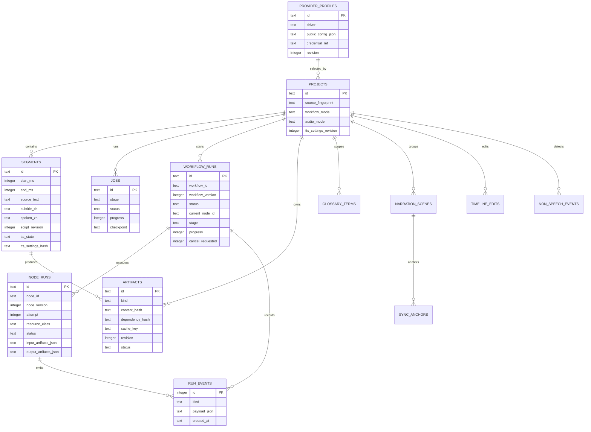
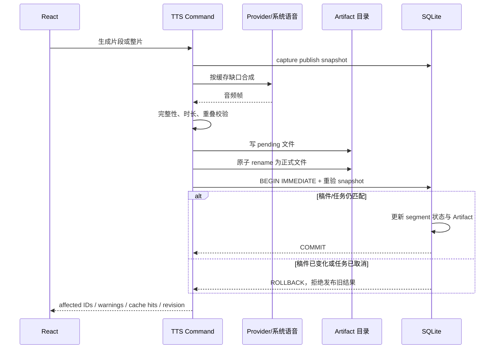
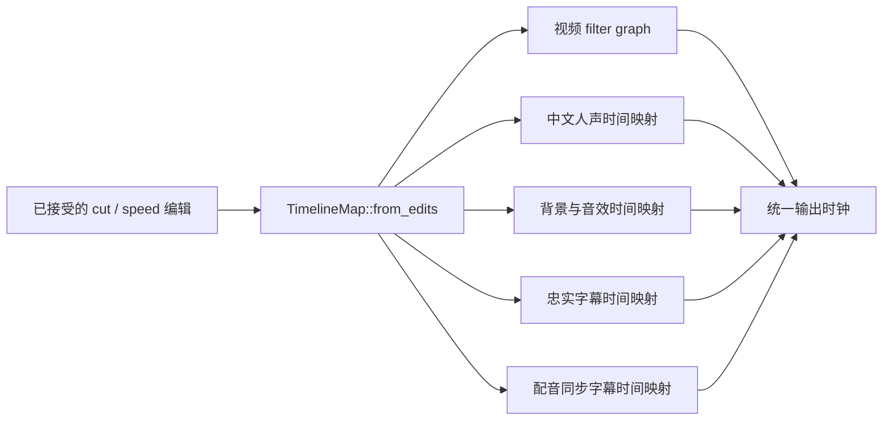
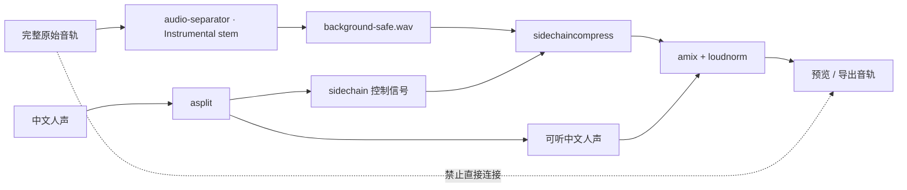
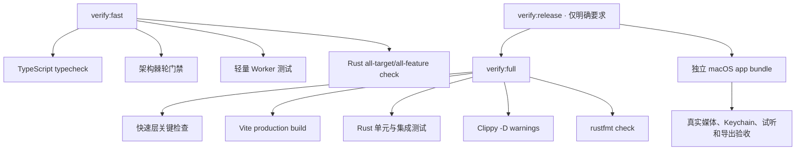

# 译声工坊系统技术方案

> 文档状态：当前实现说明 + 演进设计
> 基线日期：2026-08-14
> 适用读者：新加入开发者、架构评审者、媒体/AI/桌面端工程师
> 相关决策：[ADR-001 本地优先 Tauri](./ADR-001-local-first-tauri.md)、[ADR-002 版本化工作流 Runner](./ADR-002-versioned-workflow-runner.md)

## 1. 文档目的

本文回答四个问题：

1. 译声工坊使用了哪些技术，为什么这样选择；
2. 一段英文视频如何经过本地媒体处理、识别、翻译、配音和导出；
3. 长任务恢复、时间轴同步、缓存正确性、原声安全和第三方 Provider 差异是如何处理的；
4. 当前实现与目标架构之间还有哪些差距，后续应从哪里继续开发。

本文以仓库当前代码为事实源。标记含义如下：

- **已实现**：当前主链路已有代码和自动测试；
- **部分实现**：核心机制存在，但打包、真实样片或边界覆盖尚未完成；
- **目标方案**：ADR 已接受，仍在分阶段迁移，不应被描述成当前能力。

## 2. 系统定位与设计约束

译声工坊是一款 macOS 本地优先的 AI 视频中文化桌面应用。目标输入是用户有合法使用权的本地英文视频，目标输出是带中文配音的视频、独立中文音轨和多种字幕文件。

核心约束：

- 原视频、原始音轨、代理视频、识别结果、工程数据库和中间产物留在本机；
- 在线翻译只发送必要文本、上下文和术语；在线 TTS 只发送中文口播稿和声音参数；
- 前端不能执行任意 Shell，也不能获得任意文件系统权限；
- 10～30 分钟媒体处理属于可暂停、可恢复、可局部重做的长任务；
- 字幕、中文人声、背景轨和视频必须共享同一发布时间轴；
- “安全原声模式”不能在失败时静默回退到完整英文原声；
- 用户修改稿件或服务商设置后，旧音频不得被误当成当前结果发布。

这些约束决定了项目采用“桌面模块化单体 + 本地 Sidecar + 用户自带 Provider”的方案，而不是上传型 Web 服务或网络微服务。

## 3. 技术栈

| 层次 | 当前技术 | 用途 | 状态 |
|---|---|---|---|
| 桌面容器 | Tauri 2 | macOS 窗口、IPC、受控文件访问、事件、应用数据目录 | 已实现 |
| 前端 | React 19、TypeScript、Vite 6 | 桌面工作台、编辑器、任务队列和浏览器演示构建 | 已实现 |
| UI | Ant Design 6、Phosphor Icons | 密集型编辑器组件和统一图标语义 | 已实现 |
| 服务端状态 | TanStack Query 5 | 项目、任务、片段、Provider、预览等查询缓存与失效 | 已实现 |
| 编辑会话状态 | Zustand 5 | 选择、播放头、缩放、编辑历史、撤销/重做 | 已实现 |
| 核心语言 | Rust 2021 | 领域校验、任务状态、数据库、媒体与 Provider 适配 | 已实现 |
| 持久化 | SQLite + rusqlite bundled，WAL | 项目、片段、任务、Artifact、术语和时间编辑 | 已实现 |
| 凭据 | macOS Keychain / keyring | API Key、讯飞密钥包；SQLite 只保存引用 | 已实现 |
| HTTP | reqwest + rustls | OpenAI 兼容翻译、阿里百炼 HTTP TTS | 已实现 |
| WebSocket | tokio-tungstenite + rustls | 阿里实时 TTS、讯飞流式语音 | 已实现 |
| 媒体 | FFmpeg / ffprobe | 探测、抽音频、代理、响度、裁剪、混音、字幕烧录、导出 | 已实现；正式 Sidecar 许可证门禁待完成 |
| 本地 ASR | whisper.cpp 1.9.2 + `small.en` | 英文时间戳识别 | 已实现；运行时安装器待完善 |
| 人声分离 | audio-separator 0.44.5 + `UVR-MDX-NET-Inst_HQ_3.onnx` | 生成不主动回混完整英文的背景与音效轨 | 代码已实现；正式打包与多样片验收未完成 |
| 本地 TTS | macOS `/usr/bin/say` | 零云端依赖的系统中文语音 | 已实现 |
| 在线 TTS | 阿里百炼 Qwen/CosyVoice、讯飞超拟人 | 高质量中文配音、连续旁白和演绎参数 | 已实现 |
| 工作流内核 | Rust 版本化 DAG Runner + SQLite 运行事件 + Tokio 资源信号量 | 真实节点执行、审核、重试、取消、恢复、观测和兼容任务投影 | M4 已投入生产主链路 |
| 验证 | Rust 单元/集成测试、Clippy、rustfmt、tsc、Vite build、架构门禁 | 本地分层验收 | 已实现 |

## 4. 总体架构

### 4.1 运行时与信任边界



系统没有自建媒体后端：文件不会先上传到开发者服务器再处理。外部 Provider 是唯一网络数据出口，并且由用户显式配置。

### 4.2 代码层次与依赖方向

当前仓库是模块化单体，前后端通过 Tauri IPC 分开：



生产队列 IPC 已收敛到 `workflow_commands.rs`。遗留 `commands.rs` 仍承载 TTS/Provider 算法，是下一轮模块拆分债务。当前依赖方向是：

```text
React Feature UI
  -> generated IPC contracts
  -> application use cases
  -> workflow/domain
  -> ports
  <- infrastructure adapters
```

目标结构不要求拆成微服务，也不要求立即拆成多个 Cargo crate；优先在单进程内建立可测试边界。

## 5. 端到端处理链路

### 5.1 用户工作流

```mermaid
flowchart LR
    A["导入本地视频"] --> B["ffprobe 检查与源指纹"]
    B --> C["抽取 16 kHz 单声道识别音频"]
    C --> D{"原声模式"}
    D -- "separate" --> E["本地人声分离 · 安全背景轨"]
    D -- "duck / mute" --> F["继续"]
    E --> G["生成 720p 级代理与缩略图"]
    F --> G
    G --> H["whisper.cpp 英文 ASR"]
    H --> I["术语与非语言事件"]
    I --> J["批量翻译 · 字幕稿/口播稿分离"]
    J --> K{"工作流模式"}
    K -- "先校对" --> L["等待用户审核"]
    K -- "快速生成" --> M["脚本导演与 TTS"]
    L --> M
    M --> N["时长适配与 Artifact 发布"]
    N --> O["中文预览"]
    O --> P["后端导出预检"]
    P --> Q["MP4 + WAV + SRT + ASS"]
```



### 5.2 当前任务控制面

`workflow_runs + node_runs + run_events` 是生产执行权威；`jobs` 保留 `JobStage + JobStatus + progress + checkpoint` 作为 UI 兼容投影和旧编辑命令的状态边界。Queue/App 只发送开始、继续、重试、暂停、取消意图，不读取 stage 决定下一个执行函数。

升级前已存在但没有 `workflow_run` 的任务使用显式兼容分类：媒体、ASR 等早阶段任务可被 Runner 接管；停在 TTS、对齐、导出等晚阶段的暂停/等待任务返回编辑器继续人工输入；成功和取消任务保持终态。这样版本升级不会把已有晚阶段结果从媒体准备开始重算。



已实现的保护：

- Rust 与 TypeScript 均使用类型化 `JobStage`；SQLite 读到未知阶段会失败；
- SQLite 唯一部分索引保证同一时刻最多一个 `running` 重型任务；
- checkpoint 仅允许运行中的任务更新，进度使用 `MAX` 防止倒退；
- 应用启动时将中断的运行任务恢复为可继续状态；
- 已取消任务不能继续 checkpoint，也不能发布 TTS 产物。

旧媒体、ASR、翻译和 job 手工交接命令已从 Tauri handler 删除；架构门禁同时拒绝前端 stage 分发和旧 Bridge 调用。

### 5.3 生产 Workflow Runner

ADR-002 的固定、版本化 DAG Runner 已完成 M1～M4 并接管生产队列：



生产定义版本为 4，固定节点为 `media_prepare → asr → transcript_review → translation → script_review → tts_synthesis → alignment_validation → mix_preview → export_publish`。快速和审核模式共享 DAG；审核模式第一次到达 gate 返回 `WaitingForInput`，显式 continue 产生新 attempt 并通过 gate。导出需要用户选择目录，所以 `export_publish` 先等待外部输入；成功导出后通过幂等外部完成事件结束 run。

Runner 节点显式携带节点版本、attempt、资源类别、输入/输出 Artifact 和错误分类。全局 workflow permit 避免多个重任务违反 SQLite 单运行约束，分类信号量限制 CPU、媒体、网络和磁盘压力；`resource_acquired` 与 `node_observed` 事件记录等待与执行耗时。

## 6. 前端与 IPC 方案

### 6.1 前端状态分层

- TanStack Query 保存后端事实：项目、任务、片段、准备度、Provider、运行时、预览和导出预检；
- Zustand 只保存高频编辑会话：当前选区、播放头、缩放、静音、撤销/重做和未提交视图状态；
- 浏览器模式使用 fixture 展示界面，真实文件、Keychain、FFmpeg 和云端连接只在 Tauri 环境启用；
- `bridge.ts` 是前端唯一允许直接触发 Tauri invoke 的模块；架构门禁阻止页面绕过该入口。

### 6.2 IPC 模式

Rust DTO 使用 Serde `camelCase` 输出，枚举使用稳定的 `snake_case` 值。前端维护对应 TypeScript 类型。任务状态通过 `job://state` 事件推送，同时保留查询轮询作为恢复与丢事件兜底；TTS 自动适配进度使用独立事件。

当前 Rust/TypeScript 合同仍是两份手工声明。后续应从共享 schema 生成 DTO/client，或至少加入跨语言枚举一致性测试。

## 7. 本地数据与持久化

### 7.1 SQLite 模型



数据库启用外键和 WAL。Schema 迁移使用 `BEGIN IMMEDIATE` 包裹可重复迁移；项目删除通过外键级联清理领域记录，媒体目录删除由受控命令处理。

### 7.2 文件布局

原视频只保存路径引用和源指纹，不复制进工程。应用数据目录保存：

```text
app.db
projects/<project-id>/
  media/
    cover-first-frame.jpg
    source-16k-mono.wav
    source-full-stereo.wav
    preview-proxy.mp4
    background-safe.wav
    background-safe.json
    chinese-voice.wav
    dubbed-preview.mp4
    dubbed-preview.json
    tts/...
runtimes/...
models/...
```

项目目录是可再生文件与正式 Artifact 的承载位置，SQLite 是元数据、依赖关系和当前发布状态的事实源。

## 8. Artifact、缓存与原子发布

音频生成成本高，缓存不能只看“文件存在”。Artifact 身份至少绑定：

- 源文件指纹或上游 Artifact 哈希；
- 中文口播稿与 `script_revision`；
- Provider、Provider revision、模型、音色和演绎参数；
- TTS 同步模式与分块边界；
- 实现、媒体配方或模型版本。

TTS 发布使用快照 + Compare-And-Swap 思路防止并发编辑发布旧结果：



统一 `AtomicArtifactPublisher` 在最终路径同卷创建 staging。文件发布先做非空校验，将旧版本改名为 backup，再 rename 新版本并执行数据库提交；提交失败恢复 backup。完整导出先写隐藏 staging 目录，任一步失败由 RAII 清理，全部完成后一次 rename 为最终目录。因此用户和缓存扫描都看不到半成品。

## 9. 媒体处理方案

### 9.1 导入与媒体准备

1. `ffprobe` 读取轨道、编码、尺寸、时长和采样率；
2. 根据文件元数据和内容样本计算源指纹；
3. FFmpeg 抽取 16 kHz、单声道 PCM 供 whisper.cpp；
4. 生成最大宽度 1280 的预览代理，优先使用 VideoToolbox H.264，失败后回退 `libx264`；
5. 从首个可解码画面生成缩略图；
6. `separate` 模式额外生成 48 kHz 立体声安全背景轨。

耗时 FFmpeg/Sidecar 调用通过 Tauri blocking task 运行，不阻塞 Webview。stderr 只保留有界、清理后的摘要。

### 9.2 本地 ASR

whisper.cpp 使用 `ggml-small.en.bin`，输入是标准化后的 16 kHz PCM，输出 JSON 时间戳。系统过滤短于 300 ms 的异常片段，为每个识别片段生成稳定 UUID，并在数据库层原子替换项目片段。

ASR 文本是源语言事实，但不是最终字幕时间轴，也不是最终配音分块边界。

### 9.3 翻译与结构化口播

翻译走 OpenAI 兼容的 `/chat/completions` 接口，可接入 DeepSeek、阿里百炼或用户配置的兼容服务。每批输入包含片段 UUID、原文和时间预算，输出必须同时提供：

- `subtitleZh`：忠实、完整的中文字幕；
- `spokenZh`：适合口语和时长预算的中文配音稿。

返回结果会严格校验 ID 集合、重复项和数量。JSON 格式异常先做受控重试，仍失败时退化到单片段请求，不把模型自由输出直接写入数据库。

结构化 `ScriptDocumentV1` 保存文本、停顿、强调、保护词和来源。`spoken_zh` 是兼容投影；支持原生指令的 Provider 接收导演提示，不支持的 Provider 接收等价标点或文本渲染。

## 10. 中文配音与同步

### 10.1 Provider Adapter

统一的 `TtsProviderAdapter` 接收 `SynthesisRequest`，返回带编码、采样率、请求 ID 和计费字符信息的音频结果。

当前 Driver：

- `system`：macOS `say`，本地 AIFF 后转标准 PCM；
- `aliyun_tts` / `bailian_tts`：Qwen/CosyVoice HTTP 或实时 WebSocket；
- `iflytek_super_tts`：官方 WSS，支持 APIPassword 或 APIKey/APISecret 签名方式。

适配层负责能力差异，不让 Provider 特有字段扩散到编辑器。例如讯飞只有特定 `x4_` 音色支持 oral 参数；阿里不同模型的 endpoint、返回形态和指令能力不同。

### 10.2 同步模式

| 模式 | 合成单元 | 主要目标 | 代价 |
|---|---|---|---|
| strict | 单片段 | 最强时间边界和局部重做能力 | 语气更碎 |
| balanced | 相邻短块 | 连贯性和可校验窗口平衡 | 修改可能影响同块片段 |
| narration | 章节窗口 | 更自然的连续旁白 | 重生成范围更大 |
| semantic | 场景/节拍 | 允许场景级重写和语义连续 | 依赖阿里实时 TTS，映射更复杂 |

连续上下文不能无限扩大。系统把语义重写窗口、声学生成窗口和发布时间轴分开：大窗口用于理解，小窗口用于可验证合成，最终 Artifact 再映射回确定的时间范围。

### 10.3 时长适配

系统先裁剪音频首尾静音，保留句中自然停顿；然后检查完整性、实际时长和目标窗。常规自动适配限制在自然变速区间，无法安全放入时间窗的片段保留 warning，而不是强制压缩到不可听。

片段状态同时保存结果和证据：实际 TTS 时长、设置哈希、错误信息和溢出风险。导出可以阻止 stale/failed 等硬错误，也可以让用户知情处理非阻断时长 warning。

## 11. 单一时间映射与非破坏编辑

用户接受的裁剪或变速编辑被编译为 `TimelineMap`。它把源时间切成一组不重叠 `TimelineSpan`，每个 span 同时包含源区间、输出区间、操作和速率。



如果视频、音频和字幕分别推导裁剪时间，后半段会累计漂移。因此所有发布产物必须消费同一个 `TimelineMap`；重叠编辑在构建映射时直接拒绝。

字幕分为两套：忠实字幕跟随翻译片段；配音同步字幕从最终 TTS Artifact 的发布时间推导。这样场景级重写、一对多或多对一口播不会让字幕仍停留在旧 ASR 时钟上。

## 12. 原声处理与安全混音

支持三种原声策略：

- `duck`：保留完整原声并在中文出现时压低，兼容性高，但存在英文残留风险；
- `mute`：只输出中文人声，不引用原始音轨；
- `separate`：只允许本地分离得到的背景/音效轨与中文人声进入最终混音。

安全模式采用轨道白名单，而不是依赖 ASR/VAD 判断“什么时候恢复英文”：



`background-safe.json` 绑定源指纹、分离模型和运行时版本。任一不匹配都使缓存失效。组件缺失、模型失败或输出异常时流程停止，不能回退到完整原声。

同一中文流既作为 sidechain 控制信号又作为可听信号时，FFmpeg 图中必须先 `asplit=2`。否则一个消费者可能耗尽帧，导致最终只剩背景或错误混音。预览配方另有版本化 manifest，避免滤镜升级后复用旧文件。

## 13. 导出与发布质量门禁

导出不是“文件存在即可”。后端 `export_preflight` 汇总共享发布事实：

- 片段是否缺少翻译或中文口播；
- TTS 是否 missing、stale、failed；
- 脚本和音频 revision 是否匹配；
- 时间区间是否重叠，TTS 是否存在阻断性布局错误；
- 安全模式背景轨是否存在且依赖清单有效；
- 可修复时长问题是阻断项还是 warning。

前端项目库、编辑器和导出弹窗消费同一后端准备度与预检结果，不各自猜测“是否可导出”。

导出结果包括：

- H.264/AAC 中文配音 MP4；
- 48 kHz 中文 WAV；
- 英文 SRT、中文 SRT、中英双语 ASS；
- 配音同步 SRT 和配音同步双语 ASS；
- `separate` 模式下经过同一 TimelineMap 的背景与音效 WAV。

已有输出目录不会直接覆盖，而是选择新版本目录。无字幕且未编辑视频时可复制视频流；需要裁剪、变速或烧录字幕时使用 VideoToolbox H.264 编码。

## 14. 安全、隐私与供应链

### 14.1 凭据与日志

- Keychain 保存秘密值或序列化密钥包，SQLite 只保存 `credential_ref`；
- `TtsSecretBundle` 不提供普通 Debug 输出；
- Provider 错误只保留受限长度的安全码、消息和请求 ID；
- 诊断不得包含密钥、Authorization、字幕正文、音频和不必要的完整路径；
- 独立 TTS smoke harness 从 Keychain 读取凭据，不通过命令行传密钥，并有硬超时。

### 14.2 网络边界

- reqwest 使用 rustls，不依赖系统 OpenSSL；
- 阿里 TTS endpoint 按模型和地域做官方 HTTPS allowlist；
- Provider 返回的音频 URL和跳转再次校验，拒绝 localhost、私有地址和非预期对象存储主机；
- 讯飞只接受固定官方 WSS 路径；
- Tauri CSP 只开放自身资源、受控 asset protocol 和 IPC；asset scope 限制在应用项目目录。

### 14.3 Runtime 供应链

开发期可以发现 Homebrew/系统路径，正式发布必须使用受控 Sidecar。FFmpeg 发布构建需要满足 LGPL 约束；whisper.cpp、模型和分离运行时需要固定版本、SHA-256、架构、许可证与来源。未来在线 Runtime manifest 还必须带 Ed25519 签名。

## 15. 关键技术难点与解决方案

| 难点 | 失败方式 | 当前解决方案 | 状态 |
|---|---|---|---|
| 长任务跨重启恢复 | UI 关闭后阶段丢失或误报成功 | 真实节点持久化 run/node/event、运行节点转 retryable、显式恢复、完成节点按版本跳过 | 已实现 |
| 前后端双控制面 | UI 与后端对下一阶段理解漂移 | 生产版本化 DAG；Bridge 只发送意图；前端 stage 分发门禁 | 已实现 |
| 并发资源争用 | 多任务同时跑 FFmpeg/Provider 导致过载或违反单运行约束 | 全局 workflow permit + CPU/Media/Network/Disk 分类信号量，记录等待时长 | 已实现 |
| 半成品发布 | 崩溃、取消或数据库提交失败后覆盖可用产物 | 同卷 staging、非空校验、rename、backup 回滚、导出目录 RAII | 已实现 |
| 编辑后旧音频误发布 | 合成期间稿件或设置变化 | script/settings revision、依赖哈希、发布快照、事务内 CAS | 已实现 |
| 局部重生成成本 | 修改一行触发整片云端调用 | 片段/块/场景缓存、受影响范围计算、Artifact 复用 | 已实现 |
| 中文时长与原片不一致 | 音频重叠、硬压缩、节奏破坏 | 分层同步模式、首尾裁剪、自然变速区间、warning 与自动适配 | 已实现 |
| 场景连贯与同步冲突 | 大块自然但无法定位，短块准确但碎 | 语义窗口、声学窗口、发布窗口分层 | 已实现 |
| 字幕与最终人声错位 | ASR 时钟无法表达重写后的中文 | 忠实字幕和配音同步字幕分离，后者由 TTS Artifact 派生 | 已实现 |
| 非破坏裁剪产生累计漂移 | 视频、音频、字幕各自计算编辑 | 单一 `TimelineMap` 驱动所有发布产物 | 已实现 |
| 保留 SFX 又不泄漏英文 | 无讲话区间恢复完整原声 | 本地分离 + 允许轨道白名单 + 失败不降级 | 部分实现 |
| FFmpeg 一条流被两个消费者使用 | sidechain 消耗音频后 amix 缺少中文 | 显式 `asplit` 分出控制流和可听流 | 已实现并有回归测试 |
| Provider 协议和能力不同 | 参数被拒、流缺帧、鉴权形态不同 | Adapter、官方 endpoint 校验、响应状态机、确定性错误熔断 | 已实现 |
| 切换 TTS Provider 后音色串用 | 阿里 voice ID 被发给讯飞 | Provider 命名空间迁移，切换时只清理供应商专属覆盖 | 已实现 |
| macOS 文件拖放拿不到绝对路径 | DOM drop 只有浏览器 File | Webview 原生 drag/drop 取路径，统一收敛到媒体探测入口 | 已实现 |
| 发布状态在多个页面不一致 | 项目库说可导出，弹窗又阻止 | 后端 readiness/preflight 作为共享事实 | 已实现 |

详细证据和工程复盘见 [LEARNING_LOG](../engineering/LEARNING_LOG.md)。

## 16. 并发、失败与可靠性

- 数据库使用进程内 `Mutex<Database>`，SQLite 使用 WAL；需要发布一致性的操作使用 `BEGIN IMMEDIATE`；
- 唯一索引和 `start_job` 双重限制单个重型任务；
- 每个项目有预览生成锁，避免并发覆盖同一预览；
- 临时媒体采用 `.pending` 文件/目录，校验后原子 rename；
- Provider 超时、限流和网络错误与鉴权、模型、音色错误分开分类；确定性错误不对剩余几十个单元重复请求；
- 取消或稿件 revision 变化会阻止数据库发布，即使外部调用已经返回；
- 缓存命中仍验证实际文件大小、依赖和 manifest，而不是只信数据库状态。

Runner 已把取消令牌、资源类别、attempt、重试预算和追加式运行事件统一到真实节点合同。

## 17. 验证体系



重点回归合同：

- 片段不得重叠，时间编辑不得重叠；
- 取消任务不能 checkpoint 或发布；
- 运行进度不能倒退；
- 未知持久化阶段必须失败；
- 稿件变化后原子 TTS 发布必须失败；
- 安全/mute filter graph 不得引用完整原声；
- Provider endpoint、鉴权包、流结束状态和敏感错误输出必须符合合同；
- 预览和安全背景缓存必须绑定配方、源指纹、模型和运行时版本。

涉及真实 FFmpeg、系统权限、Sidecar、Keychain 或主观音质的变更仍需真实桌面验收，不能用浏览器 fixture 或纯单测替代。

## 18. 代码导航

| 入口 | 职责 |
|---|---|
| `src/App.tsx` | 应用查询、工作流启动意图和全局任务交互 |
| `src/bridge.ts` | 前端唯一 Tauri IPC/事件门面 |
| `src/store.ts` | 编辑会话状态与撤销/重做 |
| `src/pages/QueuePage.tsx` | 任务投影展示，不包含阶段执行分发 |
| `src/features/workflow/useWorkflowActions.ts` | 前端工作流意图 hook 与查询失效 |
| `src/components/EditorPage.tsx` | 编辑器查询、预览、片段修改与局部生成 |
| `src-tauri/src/lib.rs` | Tauri 启动、AppState 和 command 注册 |
| `src-tauri/src/domain.rs` | IPC DTO、JobStage/Status、项目/片段/Artifact 类型 |
| `src-tauri/src/db.rs` | SQLite schema、迁移、Repository 和事务合同 |
| `src-tauri/src/media.rs` | 探测、媒体准备、预览、人声分离与缓存 manifest |
| `src-tauri/src/asr.rs` | whisper.cpp 调用与时间戳解析 |
| `src-tauri/src/translation.rs` | OpenAI 兼容翻译、结构化响应校验和回退 |
| `src-tauri/src/script.rs` | 结构化口播文档与 Provider 特定渲染 |
| `src-tauri/src/director.rs` | 保护词、强调、停顿和导演计划 |
| `src-tauri/src/tts_provider.rs` | TTS Adapter、协议、安全校验与流处理 |
| `src-tauri/src/tts.rs` | 音频完整性、裁剪、时长适配和对齐 |
| `src-tauri/src/timeline_map.rs` | 单一源时间到输出时间映射 |
| `src-tauri/src/exporter.rs` | 字幕、TimelineMap 消费、混音和最终导出 |
| `src-tauri/src/commands.rs` | 当前 Tauri command 与兼容应用编排 |
| `src-tauri/src/workflow/mod.rs` | Runner 合同、节点结果、资源/重试分类和取消令牌 |
| `src-tauri/src/workflow/runner.rs` | 版本校验、顺序 DAG 驱动、幂等跳过和阻塞结果处理 |
| `src-tauri/src/application/production_workflow.rs` | 版本 4 生产 DAG、真实节点与审核门 |
| `src-tauri/src/workflow_commands.rs` | 开始/继续/重试/暂停/取消 IPC 薄适配 |
| `src-tauri/src/infrastructure/workflow_store/` | 工作流 SQLite schema、运行记录、事件与兼容任务投影 |
| `src-tauri/src/infrastructure/artifact_publisher.rs` | 文件和目录 staging、原子发布与回滚 |

## 19. 当前技术债与演进路线

### 已完成：M0 架构和合同基线

- 顶层架构地图、可靠性目标、质量基线和 ADR；
- Rust/TypeScript 类型化 `JobStage`；
- SQLite 未知阶段严格失败；
- 文件增长、越层 SQL、直接 invoke 和裸阶段字符串门禁。

### 已完成：M1～M4 生产工作流收口

- 已增加 `WorkflowDefinition`、`WorkflowNode`、`NodeOutcome`、`ExecutionContext`；
- 已增加取消令牌、资源类别、重试分类和运行状态迁移门禁；
- 已增加 `workflow_runs`、`node_runs`、`run_events` 与 V5 迁移；
- fake nodes 已覆盖完成、失败、等待审核、取消、重试预算和跨进程恢复；
- 已从追加式 `job_projection` 事件恢复兼容 `JobSummary`；
- 重复驱动不会重跑或重复发布相同版本的已完成节点输出。

### 下一步：质量深化

1. 把遗留 TTS/Provider 算法从 `commands.rs` 迁入 application services，继续收紧 5300 行上限；
2. 从共享 schema 生成 Rust/TypeScript IPC 合同；
3. 增加录制 Provider 响应的离线 E2E，以及可自动化 Tauri IPC 桌面交互夹具；
4. 为长翻译批次和场景级 TTS 增加更细粒度的节点内恢复点；
5. 完成 Runtime 签名清单、正式 Sidecar 打包和真实媒体质量矩阵。

完整执行清单见 [WORKFLOW_REFACTOR_EXECUTION_PLAN](../engineering/WORKFLOW_REFACTOR_EXECUTION_PLAN.md)。

## 20. 开发者修改原则

1. 新业务规则优先进入 domain/application，不继续堆进 React 页面或 command；
2. 新任务阶段必须同时更新 Rust/TypeScript 合同、持久化解析和迁移测试；
3. 新缓存必须说明真实依赖、版本和失效方式；
4. 新媒体编辑必须通过 `TimelineMap` 同时作用于视频、中文人声、背景和字幕；
5. 新 Provider 必须实现 Adapter、凭据形态校验、endpoint 安全、错误分类和契约测试；
6. 任何安全模式失败都不能回退到被禁止的数据路径；
7. 日常运行 `pnpm verify:fast`，交付前运行 `pnpm verify:full`；
8. 涉及音频图、Sidecar、Keychain 或导出时，补做真实 `.app` 交互与媒体检查。
