# 阿里 TTS 英转中小白全流程实测

日期：2026-08-14
产品：译声工坊 macOS 桌面应用
审计模式：UX + 可见无障碍风险
测试目标：让第一次使用的用户从 10 分钟英文视频顺利得到中文配音视频

## 结论

当前版本不能让小白可靠走完整条阿里 TTS 链路。本次实测完成了视频导入、英文识别、162 段中文翻译以及部分阿里百炼 Cherry 配音，但未能生成可导出视频。最终任务已主动暂停，避免“整片重新配音”重复消耗云端额度。

阻断不是单点故障，而是恢复链路互相矛盾：默认安全模式的人声分离稳定失败；静音原声绕过后，阿里 TTS 分批卡住；导出定位没有定位；局部重生成又要求先完成整片；重启后进度、问题数和错误原因改变；最后一次重试把已完成的语音缓存全部置为待生成。

## 测试配置

- 素材：`RAG Explained For Beginners [_HQ2H_0Ayy0].mp4`
- 媒体：1920×1080，10:09，40 MB，162 个片段
- 翻译：DeepSeek
- 配音：阿里百炼 TTS，`qwen3-tts-instruct-flash`，Cherry
- 首次路径：自动生成 + 安全模式（只替换人声）
- 降级路径：自动生成 + 静音原声

## 流程步骤与健康度

1. 服务商连接 — **基本健康**：阿里 TTS 测试通过，但成功反馈只有卡片角落的“已验证”，没有试听或明确下一步。
2. 导入英文视频 — **基本健康**：文件规格和权利确认清楚；系统文件选择器出现与本地可读状态矛盾的“配额不足”标记，需排查与云盘状态的关系。
3. 选择生成方式 — **有风险**：自动生成和安全模式解释充分，但没有在开始前验证人声分离是否真的可用。
4. 选择阿里 TTS — **健康**：引擎、声音和数据发送范围清楚；新建第二个项目时又默认回到讯飞，没有记住刚使用的阿里选择。
5. 开始处理 — **健康**：最终确认页能复核翻译、配音、原声模式和项目名。
6. 默认安全模式 — **阻断**：4% 时人声分离失败，重试后在 9% 再次失败；错误框直接显示命令行日志和本机路径，没有真正可行动的原因或“切换到静音原声”。
7. 静音原声降级 — **勉强可走**：必须重新建项目、重新选文件和服务商，无法在失败项目内一键切换。
8. 识别与翻译 — **结果成功、反馈失败**：162 段识别和翻译完成，但任务队列长时间停在 4%，阶段文字与真实处理阶段不同，没有片段计数或预计时间。
9. 阿里 TTS — **阻断**：部分语音生成成功后长时间无进展；前台仍显示 4% 或 94%，无法判断是排队、限流、超时还是正在重试。
10. 暂停与继续 — **高风险**：暂停能保留部分结果，但“处理 27 个配音问题/处理 86 个时长问题”实际会恢复后台任务，按钮文案与动作不一致。
11. 导出预检 — **阻断**：显示 80 个发布问题，失败片段使用 UUID 而不是片段序号、时间和文案；“定位并修复”返回第 1 个已就绪片段，没有定位到阻断项。
12. 局部恢复 — **死胡同**：手动到达首个未生成片段后，界面仍标“已就绪”；点击“重新生成当前语音块”却提示必须先完成一次整片配音。
13. 重启恢复 — **数据可信度失败**：重启前为 94%/80 个导出阻断，重启后项目库为 63%，队列为 161 个阻断，并把局部操作的校验提示写成整条任务的中断原因。
14. 最终重试 — **费用与数据风险**：重试后已完成的 81 段被全部置为待生成，开始从头走云端 TTS。已立即暂停，未继续重复计费。
15. 输出结果 — **未达成**：没有生成可导出的阿里 TTS 中文视频。

## 关键证据

### 1. 服务商已验证

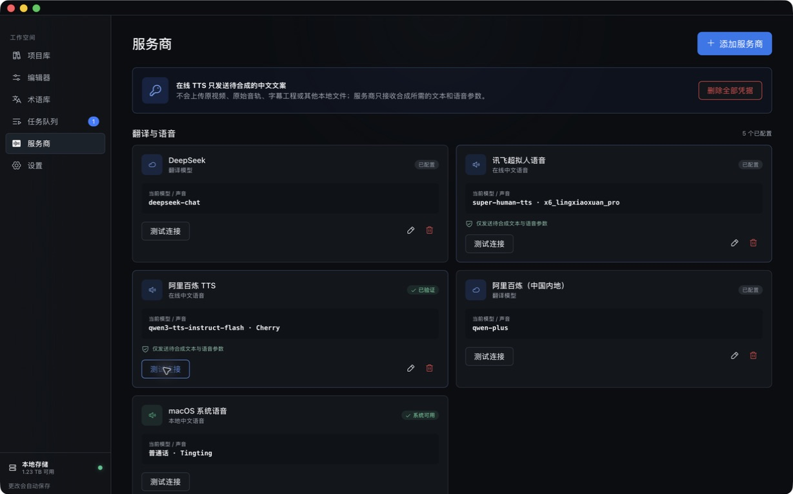

亮点：明确告知只发送待合成文本和语音参数，原视频不上传。

问题：成功状态过小、无试听、无“可以开始新项目”的下一步。

### 2. 默认推荐路径

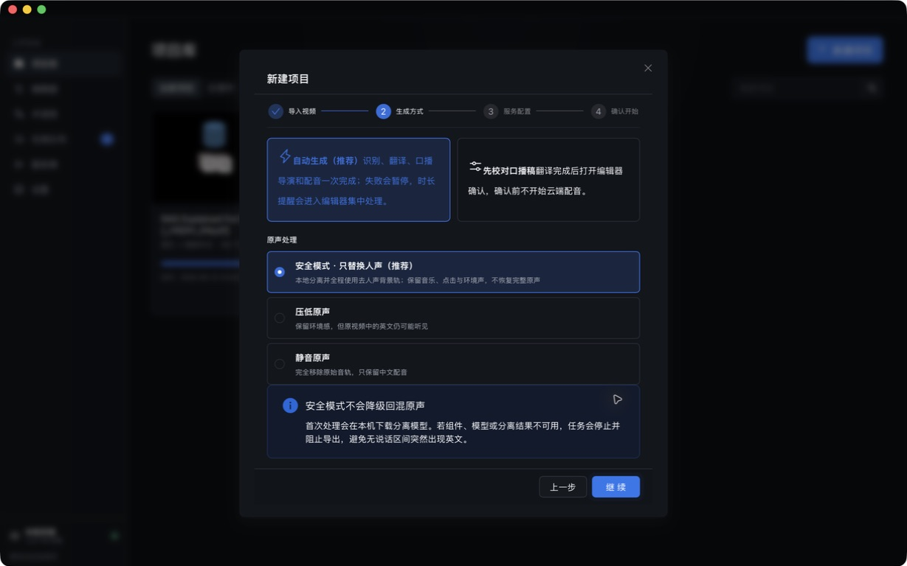

亮点：推荐项和三种原声处理的差异说得清楚。

问题：推荐的安全模式没有开工前检查；一旦分离不可用，用户只能在队列里失败。

### 3. 安全模式稳定失败

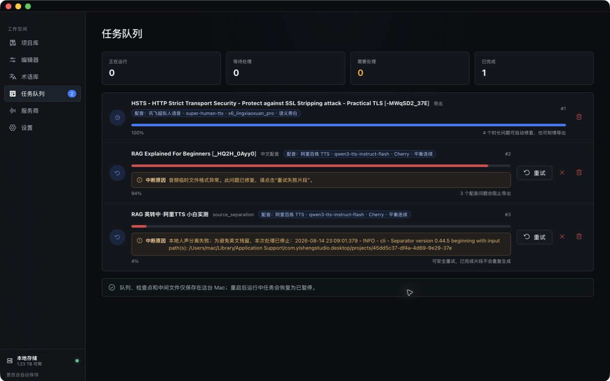

问题：用户看到的是时间戳、模块名和被截断的本机路径。需要把技术日志收进“复制诊断信息”，主界面只保留原因、影响和一键恢复动作。

### 4. 静音原声绕过

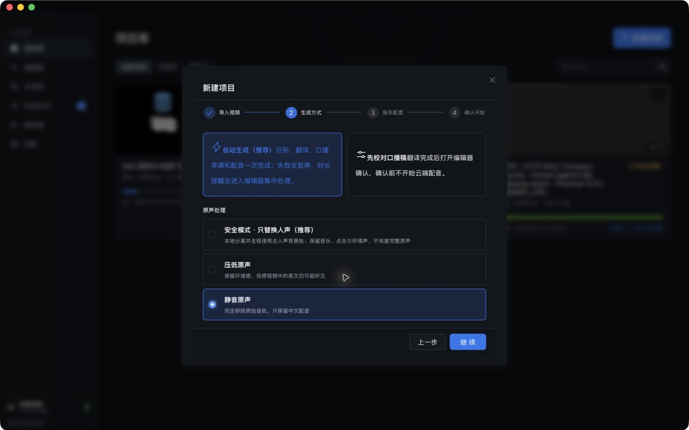

这条路能避开人声分离，但必须完整重建项目。更合理的恢复是保留识别/翻译结果，直接把项目原声模式切成静音后继续。

### 5. 处理阶段与进度不一致

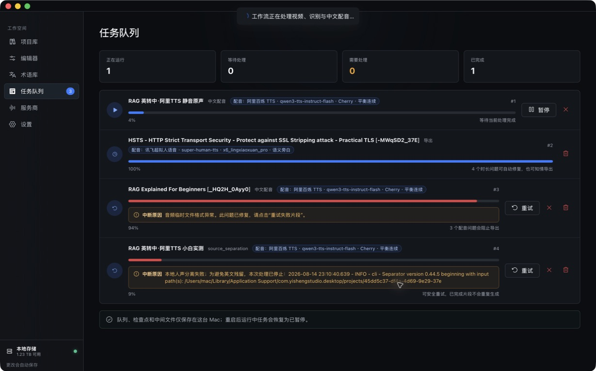

队列已经显示“中文配音”，进度却仍是 4%。用户无法知道 162 段中完成了多少，也不知道任务是否卡死。

### 6. 导出预检不可操作

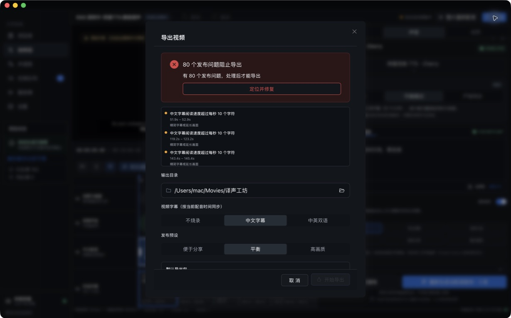

问题列表混合字幕速度提醒、非语言事件和 TTS 阻断；失败片段显示 UUID，“定位并修复”没有定位到对应片段。

### 7. 局部重生成形成循环依赖

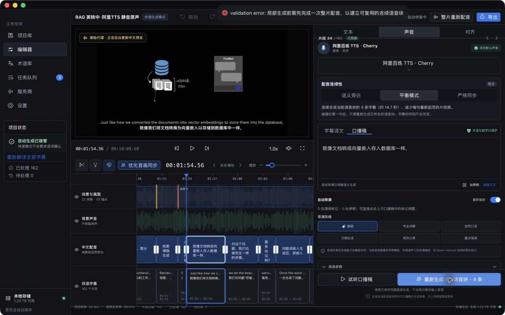

界面同时显示当前片段“已就绪”，但局部生成提示必须先完成整片。状态、动作可用性和错误规则三者不一致。

### 8. 重启后的状态漂移

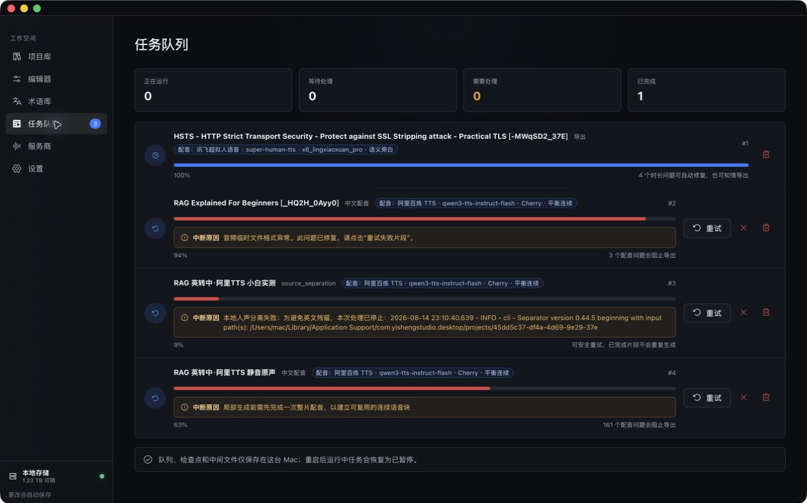

重启把 94% 改成 63%，把局部校验提示变成任务级中断原因，并把阻断数改成 161。此时用户已无法判断哪些结果被保留。

### 9. 为避免重复计费而暂停

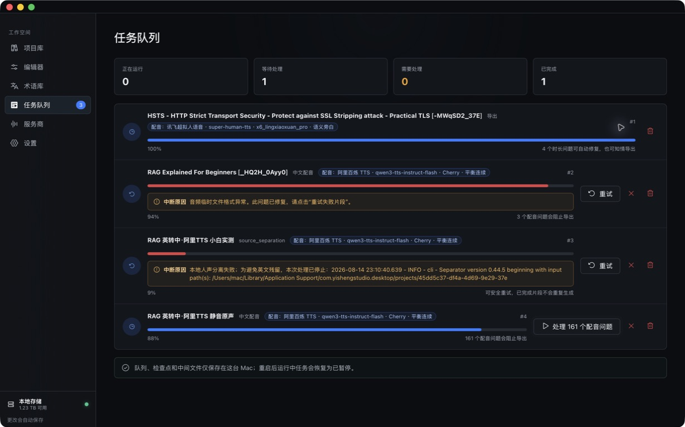

重试会重新处理整片，已暂停。当前没有安全、明确、只重试缺失片段的入口。

## 最高优先级改进

### P0：让状态可信

- 项目卡、队列、编辑器、导出预检必须读取同一份任务状态和同一套问题分类。
- 进度按阶段映射，并显示 `已完成语音块 / 总语音块`、当前动作、最近一次成功时间、重试次数和超时状态。
- 局部校验失败不能覆盖整条工作流的根错误，也不能把已完成缓存全部失效。
- “已就绪”必须严格等于该片段/语音块有可用且版本匹配的音频。

### P0：提供可完成的恢复路径

- 人声分离失败时给出三个按钮：`重试分离`、`改用静音原声并继续`、`查看诊断`。
- TTS 超时或限流时自动重试单个语音块，保留已成功块；达到上限后列出失败块而不是挂起整片。
- 允许整片首次未完成时局部重生成缺失块；不要形成“整片未完成→不能局部修→整片又卡住”的循环。
- `定位并修复`必须跳到真实阻断片段，并在时间轴和右侧面板同时高亮。

### P0：费用保护

- 重试默认只生成缺失或过期语音块，明确显示“将生成 N 块，复用 M 块”。
- 整片重新配音前给出预计字符数、预计费用区间、会失效的缓存数量和不可撤销影响。
- 如果重试会从增量变为全量，必须二次确认，不能藏在普通“重试”按钮后。

### P1：降低小白认知负担

- 服务商测试成功后提供 5–10 秒试听和“用此声音创建项目”。
- 新建项目记住上次成功使用的翻译/TTS 组合，或明确说明为什么恢复产品默认值。
- 队列默认折叠旧失败任务，把当前任务和“下一步要做什么”放在最前。
- 发布问题按“阻止导出 / 可自动修复 / 仅提醒”分组，不展示内部 UUID。

## 可见无障碍风险

- 任务卡中的阶段、进度和错误文字较小、颜色偏灰；需要做实际对比度测量。
- 超长错误文本被截断，缺少可展开区域和复制按钮，低视力用户更难从密集信息中提取关键动作。
- 成功/失败多依赖短暂顶部提示和颜色变化；需要验证 VoiceOver 是否会朗读状态更新。
- 主要按钮在辅助功能树中大多有名称，这是正向基础；但本轮未完成全键盘焦点顺序、VoiceOver、缩放和目标尺寸测试，不能据此声称符合 WCAG。

## 证据范围与限制

- 所有截图和状态都来自本轮真实 macOS 界面操作。
- 测试使用已配置的真实阿里百炼 TTS；未查看或记录任何密钥。
- 文件选择器里的“配额不足”属于系统表面，可能与云盘元数据有关，不能仅凭截图归因给译声工坊。
- 没有继续确认“整片重新配音”，因为界面明确提示可能产生费用且没有金额上限。
- 未生成成片，因此无法评价最终中文声音自然度、字幕与成片音画同步以及成片编码质量。

## 2026-08-15 修复后真实界面回归

上一节记录的是修复前状态；本节为同一英文视频、同一真实阿里百炼 TTS 项目的最终回归，结论以本节为准。测试过程中保留已经成功的语音块，没有再次全量调用云端 TTS。

### 已关闭的阻断问题

1. 人声分离失败后可在原项目中点击“改用静音原声并继续”，无需重新建项目或重复识别、翻译。
2. TTS 按语音块落盘并发布状态；暂停、重启和重试只补缺失块，已完成块可复用，界面展示完成数与复用数。
3. 导出问题使用片段序号、时间和场景标识，不再暴露 UUID；定位动作落到真实阻断片段。
4. 仅提醒性质的阅读速度问题不再让工作流进入死胡同；本项目保留 6 条提醒，由用户在导出时明确确认。
5. 导出使用应用目录中的持久预览代理，避免应用重启后失去原始外部文件访问权；导出成功后不会因为工作流投影失败而误报成片失败。
6. 配音同步字幕只有在覆盖全部有口播片段时才采用，否则自动回退到完整片段时间线。本次三份 SRT 均为 162 条。

### 最终实操结果

- 真实桌面 App 显示“导出完成”，并通过“查看保存位置”在 Finder 中选中最终文件夹。
- 在 Finder 中打开 `中文配音视频.mp4`，QuickTime 实际播放并前进到 3 秒；画面底部可见中文烧录字幕。
- 成片时长 608.700 秒，H.264 1280×720、60 fps；仅有一条 48 kHz 立体声 AAC 音轨，符合“静音原声”选择。
- 最终包包含 MP4、中文配音 WAV、中文/英文/配音同步 SRT，以及两份 ASS 字幕。
- 输出目录：`~/Movies/译声工坊/RAG 英转中·阿里TTS 静音原声 (2)`。

### 修复后证据

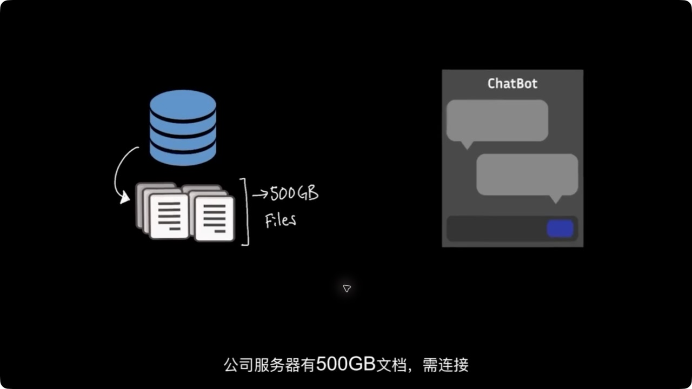

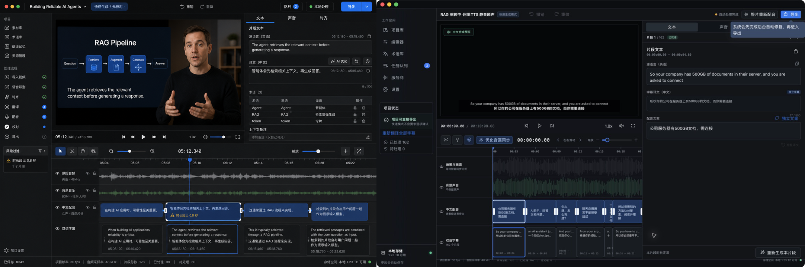

对照确认修复没有破坏专业暗色编辑器、紧凑信息密度、四轨时间轴，以及蓝/绿/琥珀/红语义色。最终成片选择了界面如实标注的“本地预览画质（最高 720p）”；这保证重启后也能稳定导出，但不应被宣传为 1080p 原画导出。

final result: passed — novice recovery, cached Alibaba TTS continuation, truthful progress, export, Finder reveal and real QuickTime playback completed.
